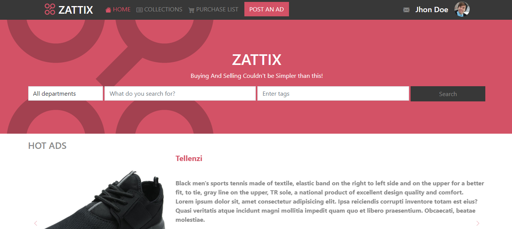

# capstone01-estore

> Fourth-week project of the Microverse program.

A personal approach to Zattix e-comerce website.

## Built With

- HTML5, CSS3 & Bootstrap.

## Live Demo

[Live Demo Link](https://JuanDavid31.github.io/capstone01-estore/)

## Author

👤 **Juan David Piza**

- GitHub: [@juandavid31](https://github.com/juandavid31)
- Twitter: [@jdpw31](https://twitter.com/jdpw31)

## Show your support

Give a ⭐️ if you like this project!

## Acknowledgments

- Shoutout to our Stand-Up Teams

## 📝 License

This project is [MIT](https://www.mit.edu/~amini/LICENSE.md) licensed.

## ✏️ Design

Typography, colors, and layout designs are property of [Mohammed Awad](https://www.behance.net/M_Awad)
